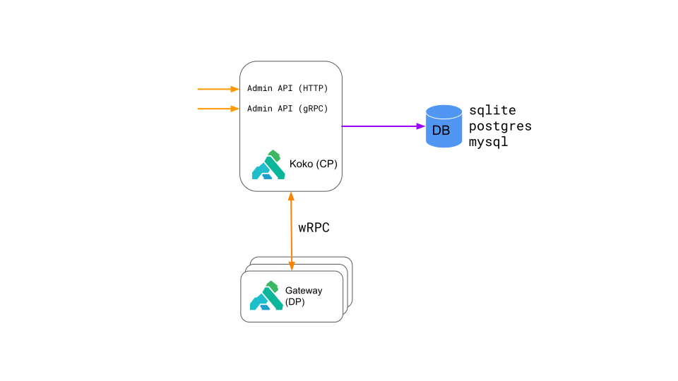

# Koko's architecture

## High-level diagram

## User-facing Admin API

Koko's user-facing API, popularly known as Kong's Admin API has been redesigned
and rewritten.
Koko's API is
[defined](https://github.com/Kong/koko/tree/main/internal/grpc/proto/kong/admin/service/v1)
using Protobuf and implemented in [gRPC](https://grpc.io).
A complete HTTP API for all user-facing needs is also provided.

## Interface with Kong

Koko communicates with Kong using [wRPC](https://github.com/Kong/kong-data-plane-spec).
wRPC is a new addition to Kong Gateway and is a bidirectional RPC protocol on
top of HTTP WebSockets.

For Kong Gateway 2.x nodes, Koko communicates using HTTP WebSockets.

## Database design

Koko supports SQLite, Postgres and MySQL databases for configuration storage.
Support for NewSQL databases like CockroachDB and Yugabyte in the future are 
under consideration.
Further storage backends have been considered but are not planned currently.

Koko stores most of the configuration in a schema-less fashion.
Details of the storage capabilities of the database used can be found in
[this file](https://github.com/Kong/koko/blob/main/internal/persistence/store.go).
This may change in a backwards-compatible manner in the future.

